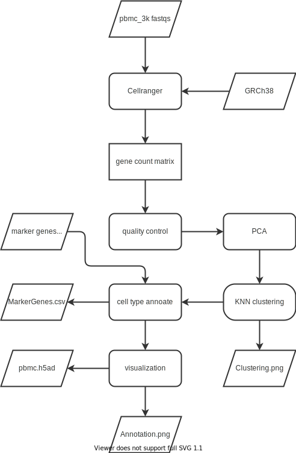

# PBMC scRNA-seq cell type annotation

- [PBMC scRNA-seq cell type annotation](#pbmc-scrna-seq-cell-type-annotation)
  - [Introduction](#introduction)
    - [Background](#background)
    - [Purpose](#purpose)
  - [Workflow](#workflow)
    - [Diagram](#diagram)
    - [Dependencies](#dependencies)
    - [Usage](#usage)
    - [Input](#input)
    - [Data](#data)
    - [Output](#output)
- [Reference](#reference)

## Introduction
### Background
scRNA-seq has revolutionized the developmental and genetic research in cell level, not only it reveals the cellular genes expression in impressively high precision, but it also can infer the interaction among those cells, obtaining compelling insights about biological mechanism. Some typical instances include cell type annotation and cell differentiation trajectory inference.

In this workflow, I am undertaking the cell type annotation, the dataset can be a very generic 10X genome dataset. For demonstration, a PBMC3k dataset is used as a simple show case. Briefly speaking, human peripheral blood mononuclear cells (PBMCs) dataset is comprised of immune cells with a single, round nucleus that originate in bone marrow and are secreted into peripheral circulation. These cells are critical components of the immune system and are involved in both humoral and cell-mediated immunity, so the cell type portion often encodes some disease related patterns.

In a typical scRNA-seq cell type annotation pipeline[1], the starting point is a gene count matrix, with rows as cells and columns as genes. Sometime researchers need to start from the raw sequencing data, tools such as the Cellranger are needed to convert the fastq files to gene count matrix.
The first step is doing the quality control, removing the uninformative cells and genes and abating the batch effect. In next step, principal component analysis (PCA) and uniform manifold approximation projection (UMAP) are applied to find the lower dimensional representation of the genes profile. Then we do a k-nearest neighbors (KNN) clustering on that representation, and use Wilcoxon test to find the marker genes within each cluster, eventually get the cell type annotation after comparing with marker genes database[2].

### Purpose
To find the marker genes for each cell type in scRNA-seq dataset (PBMC is used for demo), and do cell type annotation on that dataset.

Nextflow is powerful, but due to the 2 versions of its syntax, some tutorial may be misleading and uninformative. In this project, I want to establish a brief but well organized wsl2 pipeline, including features as follows:
1. Separate processes into script files.
2. Encapsulate the environment and parameters setting into the nextflow.config file.
3. Use Singularity container for more robust environment configuration.
4. Help the beginner to understand how to use channel and pipe.
## Workflow
### Diagram

  

### Dependencies
We use Singularity container to make the workflow more portable and robust. 2 main containers are required to set the environment:
1. docker://nfcore/cellranger:6.1.2
    * Image is stored on [dockerhub](https://hub.docker.com/r/nfcore/cellranger/tags)
    * Cellranger version: 6.1.2
2. library://wykswr/biof501/sc-rna:1.0
    * Image is stored on [Sylabs](https://cloud.sylabs.io/library/wykswr/biof501/sc-rna)
    * scanpy
    * MACA

You should [install Singularity](https://docs.sylabs.io/guides/3.0/user-guide/installation.html) on your platform in order to run this pipeline.
### Usage
To test the pipeline on the server of BIOF501, go to the project's directory, and type in:

`./main.nf -w work`

Then find the all results in the output folder.

If you start analysis from the fastq files, the API is:

`./main.nf -w work --denovo true --fastqs <path of directory> --reference <path> --markerRef <path> --output <path of directory>`

However, converting format using Cellranger may consume several hours, so I strongly suggest you starting from the gene count matrix, to do so, please use this API:

`./main.nf -w work --countMat <path> --markerRef <path> --output <path of directory>`
### Input
* fastqs: Raw sequencing files in fastq format from [10Xgenomics](https://www.10xgenomics.com).
* reference: A transcriptomics reference sequence.
* countMat: Gene count matrix.
* markerRef: A CSV file which tells the marker genes of listed cell type.
### Data
* [Reference transcritome](https://www.ncbi.nlm.nih.gov/assembly/GCF_000001405.40)
* [Raw PBMC3k sequence](https://www.10xgenomics.com/resources/datasets/pbmc-from-a-healthy-donor-granulocytes-removed-through-cell-sorting-3-k-1-standard-2-0-0)
* [PBMC3k gene count matrix](https://scanpy-tutorials.readthedocs.io/en/latest/pbmc3k.html)
* [Marker genes reference](https://github.com/ImXman/MACA/blob/master/MarkerDatabase/human_pbmc_oetjen_markers.csv)
### Output
* Clustering.png: The result of KNN clustering on the quality-controlled PBMC dataset.
* MarkerGenes.csv: The marker genes of each cluster, ranked increasingly by p-value.
* Annotation.png: The UMAP visualization of cell type annotated dataset.
* pbmc.h5ad: The meta-dataset, containing the raw data, highly variated genes, high quality cells, PCs, cluster labels, and cell type annotation.

# Reference
1. Wolf, F. Alexander, Philipp Angerer, and Fabian J. Theis. "SCANPY: large-scale single-cell gene expression data analysis." Genome biology 19.1 (2018): 1-5.
2. Xu, Yang, et al. "MACA: marker-based automatic cell-type annotation for single-cell expression data." Bioinformatics 38.6 (2022): 1756-1760.